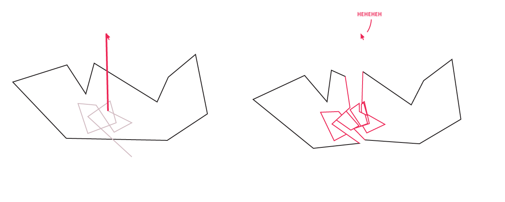
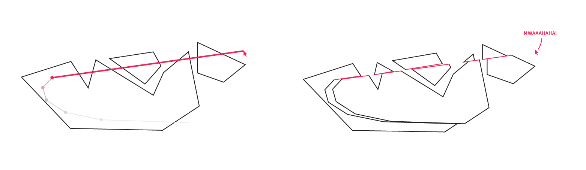

# Slice


Cutting polygons in realtime!

Here's the problem setup: we have a set of arbitrary simple polygons (define simple: polygons do not intersect themselves but may be non-convex) and mouse pointer coordinates. Both this set's positions and mouse positions are sampled in discrete time, so the mouse historical path is a polyline.

The core of the algorithm is just two steps, to differentiate two classes of interactions between the mouse and polygons.

1. Most of the time, the mouse will enter a polygon, spend some time moving inside, and leave. We can take this path it draws during this time and partition the parent polygon with it.

	 <!-- {.full-sm-down} -->

2. Occasionally, the mouse will enter and leave one or many polygons all in one timestep, in a kind of awesome swipe of carnage.

	 <!-- {.full-md-down} -->
	
To clarify this is not a dichotomy, 1) and 2) can happen simultaneously, and of course this leads to more fun!

 <!-- {.full-md-down} -->

**Details of the implementation can be found at [lam.io/projects/slice](http://lam.io/projects/slice).**

## Running

```bash
$ npm i
$ node_modules/.bin/webpack
```

Open `public/index.html`. Enjoy!